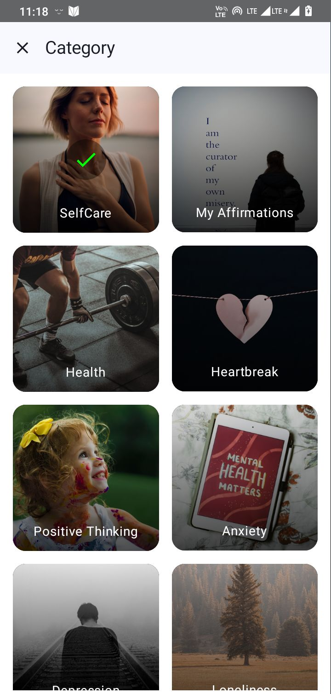
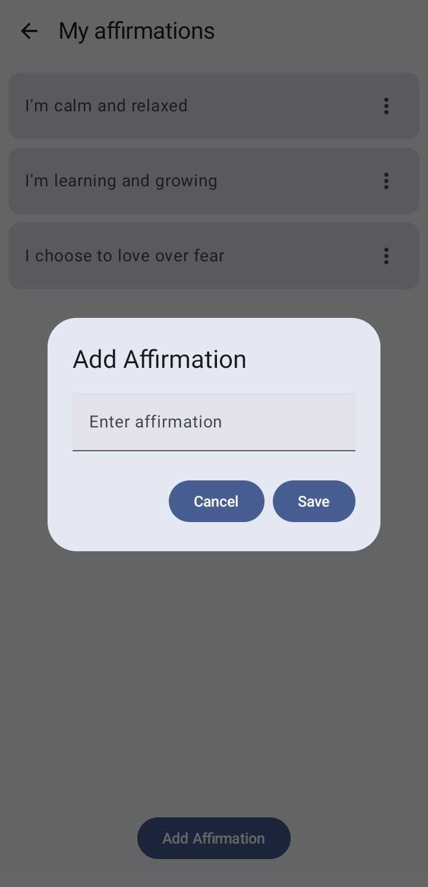
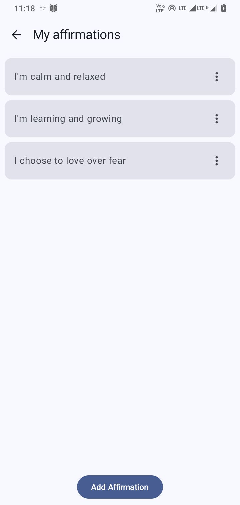
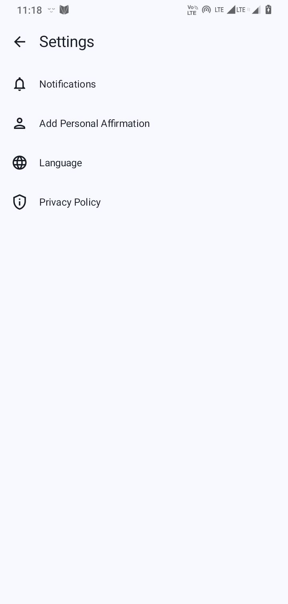

# AffirmWell

AffirmWell is a mobile application designed to deliver daily affirmations to enhance positivity and well-being. Users can select from various categories, receive notifications, and personalize their affirmations.

## Features

- **Personalized Affirmations**: Users can add their own affirmations.
- **Category Selection**: Different categories of affirmations to choose from.
- **Notifications**: Set notification times for daily affirmations.
- **Language Support**: Supports multiple languages including English, Hindi, and German.
- **Background Customization**: Change the background image for a personalized experience.

## Screenshots

<table>
  <tr>
    <td></td>
    <td></td>
    <td></td>
  </tr>
 
  <tr>
     <td></td>l̥
    <td></td>
     <td></td>
  </tr>

  <tr>
 
  </tr>
</table>

